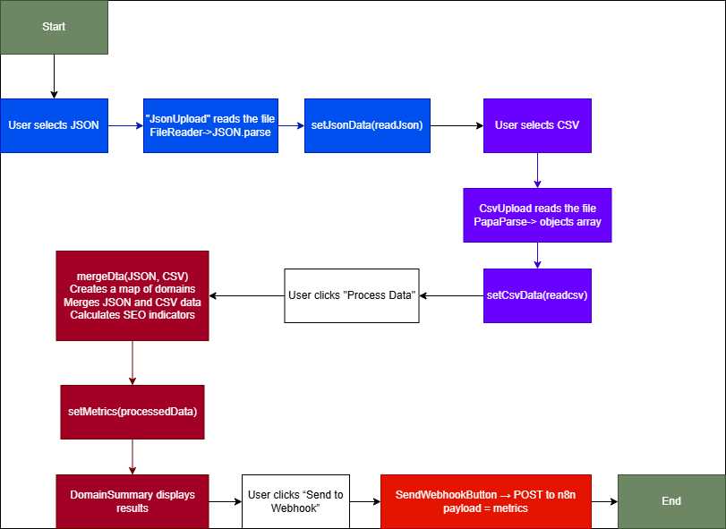

# Case Técnico - Desenvolvedor Júnior 
Esse projeto é composto por um desafio tecnico proposto para uma vaga de estagio em desenvolvimento jr

---

## Descrição

Este projeto é uma pequena aplicação web para processar dados de SEO. Ele permite fazer upload de um arquivo JSON com dados base e um CSV complementar, cruza essas informações e apresenta um resumo de métricas importantes em uma interface simples construída com TSX. Além disso, os dados processados podem ser enviados via webhook para o n8n, possibilitando exportação automática para Google Docs.

Principais métricas calculadas por domínio:
-Número de páginas indexáveis
-Quantidade de imagens sem atributo alt
-Média de autoridade das páginas
-Total de backlinks

## 📌 Estrutura e funcionamento

Este projeto inclui as principais partes a seguir:

- **Upload e parsing de arquivos:** tratamento de JSON e CSV para extração de dados.  
- **Lógica de cálculo das métricas:** cálculo de páginas indexáveis, imagens sem alt, média de autoridade e total de backlinks.  
- **Envio do webhook:** envio dos dados processados para o n8n, possibilitando exportação para Google Docs.  
- **Organização dos componentes:** componentes TSX estruturados de forma simples e reutilizável (interface, botões, resumos, etc.).  

Além disso, o projeto utiliza as seguintes tecnologias:  
- React + TSX  
- Node.js  
- n8n  
- Papaparse para CSV  
- CSS

**Possíveis melhorias futuras:**  
- Adicionar tratamento de erros mais detalhado no upload e parsing  
- Interface mais completa e responsiva  
- Relatórios visuais com gráficos  
- Testes unitários e integração

## 🖼️ Capturas de Tela




---

## ⚙️ Instalação

```bash
# Clonar o repositório
git clone https://github.com/ligiaml/seo-data-processor.git

# Entrar na pasta do projeto
cd seo-data-processor

# Instalar dependências
pnpm install

# Rodar o projeto
pnpm start
